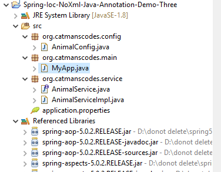

<h2> Project Structure </h2>

<h3> How to run this code in my local system ?</h3> 

<h4>For run this Spring Application You need some basic setup/requirements.</h4>
<ol>
  
  <li> Make sure you have java 8 or + running in your system </li>
  <li> You need eclipse or other IDE for better coding experience </li>
  <li> Download and extracts Spring jar files in your system (Download spring jar files : https://repo.spring.io/release/org/springframework/spring/) </li>
  <li> Create Java Project in you favourite IDE</li>
  <li> Right click on your project > go to "build path" > "Config Build Path..">Libraries > Add External Jars > Add spring jars ,apply and close </li>
  <li> Now Copy Past code from our Src folder </li>
  <li> Run MyApp.java file </li>
  
</ol>

