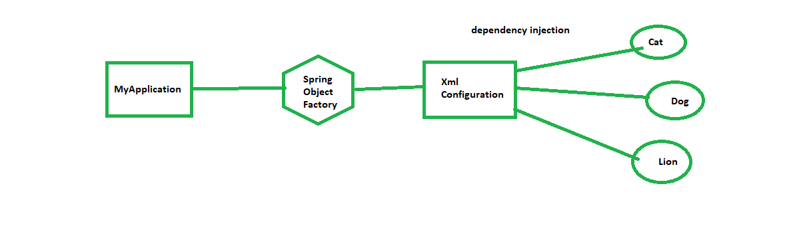
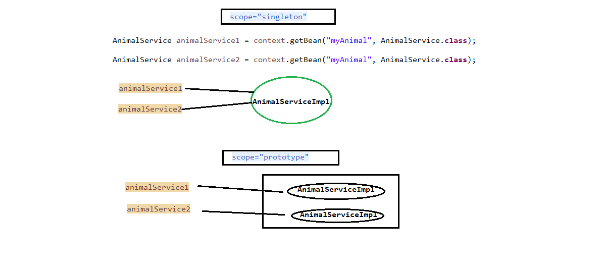
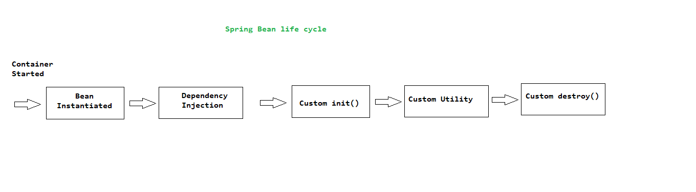

# Spring Framework

All about Java spring framework with demo Projects. I hope my work will help you to improve your spring knowledge/concepts, Spring certification exam practice, crack an interview and find a good job.

<h2> List of Topics : </h2>

<ol>
  <li> Spring Core </li>
  <li> Spring MVC </li>
  <li> Spring Boot </li>
  <li> Spring AOP </li>
  <li> Spring Test </li>
  <li> Spring Data JPA </li>
  <li> Spring Rest </li>
  <li> Spring Security </li>
</ol>

<h3> Spring Framework Runtime </h3>


<h3> 1. Spring Core </h3>

<h4> What is the spring container?</h4>

Spring container is the core part of the spring framework. The container generally, Create the objects, wired them all together, configure them and manage their life cycle (creation to destroy)

<h4> Spring container configurations:</h4>

The most common ways to configure spring container are:

1. XML based configuration (old, famous & legacy way).
2. Java Annotations (the best and easy way)
3. Java Source code

<b> Development process is in simple steps </b>

1. Configure Spring beans
2. Create a Spring container
3. Retrieve beans from spring containers

<h4> XML based configuration </h4>

Step-01: Configure Spring beans

Create test.xml

```
<beans>
	 <bean id="demo" class="org.catmanscode.Test"></bean>
</beans>
```

Step-02: Create a Spring container (It is also known as ApplicatonContext)

Spring container/application contet can be create on multiple ways

1. ClassPathXmlApplicationContext
2. AnnotationConfigApplicationContext
3. GenericWebApplicationContext

Step-03: Retrieve beans from spring containers



[Spring-Ioc-Xml-Configuration-Demo-One : Demo Project](https://github.com/catMansCodes/Spring-All/tree/master/03_SpringCore/Spring-Ioc-Xml-Configuration-Demo-One)

<h4> What is spring beans?</h4>

Spring beans simply a nothing but java object.
When Java objects created by spring container it is known as spring beans. 
In simple terms, Java objects are the spring beans.

<b>Note:</b> Spring beans and java beans are not the same because springs beans/objects maintained by container. 

<h4> Spring container functionality: </h4>

1. Create and manage spring objects (inversion of controls - IOC)
2. Inject object's dependencies (Dependency injection - DI)

The most common way of Dependency injections are :

1. Constructor injection
2. Setter Injection

<h4> Constructor injection </h4>

* Define the dependency interface and class
* Create a constructor in class for injection
* Configure the dependency injection in the spring config file

[Spring-Ioc-Xml-Config-DI-Constructor-Injection : Demo Project](https://github.com/catMansCodes/Spring-All/tree/master/03_SpringCore/Spring-Ioc-Xml-Config-DI-Constructor-Injection) 

<h5> What is purpose of no-arg constructor? </h5> 

When you don’t define any constructor in your class, compiler defines default one for you, however when you declare any constructor (in your example you have already defined a parameterized constructor), compiler doesn’t do it for you.

Since you have defined a constructor in class code, compiler didn’t create default one. While creating object you are invoking default one, which doesn’t exist in class code. Then the code gives an compilation error.


<h4> Setter injection </h4>

* Define the dependency interface and class
* Create a setter method in class for injection
* Configure the dependency injection in the spring config file

[Spring-Ioc-Xml-Config-DI-Setter-Injection : Demo Project](https://github.com/catMansCodes/Spring-All/tree/master/03_SpringCore/Spring-Ioc-Xml-Config-DI-Setter-Injection)

If you want to get some literal values using setter injection, It is quite simple as setter injection.
We just need to set values in our xml file.i.e

* Same as above example, Add 2 private parameters/string called animalType and animalName.

```
private String animalType;

private String animalName;

//generate getters and setter

```

* Now to inject above parameters, Add a property for the same.

```
<beans>
	 <bean id="demo" class="fully qualified name of package">
	 	
		<property name="animalName" value="nini" />
		<property name="animalType" value="Cat" />
	 </bean>
</beans>
```

* Next, Get property values on MyApp.Java i.e

```
	AnimalServiceImpl myAnimalServiceImpl = context.getBean("animalService",AnimalServiceImpl.class);
		
	System.out.println(myAnimalServiceImpl.getAnimalType());
	System.out.println(myAnimalServiceImpl.getAnimalName());

```

[Spring-Ioc-Xml-Config-DI-Setter-Values-Injection : Demo Project](https://github.com/catMansCodes/Spring-All/tree/master/03_SpringCore/Spring-Ioc-Xml-Config-Setter-Values-Injection)

If we want to get/read data from an external file or say properties file. it is possible in a simple way. We just need to create a new file and Add this file on XML configuration.

1. Create application.properties

```
animal.animaltype = cat
animal.animalname = nini
```
2. Add file path/class path in xml file and get values.

```
	<context:property-placeholder location="classpath:application.properties"/>

	<bean id="animalService" class="org.catmanscodes.service.AnimalServiceImpl">
		<property name="animalDao" ref="animalDao1"></property>
		
		<property name="animalName" value="${animal.animalname}" />
		<property name="animalType" value="${animal.animaltype}" />
		
	</bean>

```

Note: Make sure you are using proper version of XML schema, otherwise it may not work.

[Spring-Ioc-Xml-Config-Setter-Values-from-property-file : Demo Project](https://github.com/catMansCodes/Spring-All/tree/master/03_SpringCore/Spring-Ioc-Xml-Config-Setter-Values-from-property-file)

<h4> Bean Scopes: </h4>
- Scope refers to the life cycle of a bean.
- It defines how long bean lives, how many instances will create and store in memory, How they shared in the environment.

There is a main 5 type of scope.
1. Singleton: It is default one If we don't define a scope spring is use it. Only one instance is created and shared in singleton.
2. Prototype: It creates a new instance for each request.
3. Request: It is part of HTTP web request and uses in web applications.
4. Session: It is also part of the HTTP session and uses in web applications only.
5. Global-session: Same as Session, We can use global session based on the requirement.

<h4> Singleton VS Prototype </h4>

```
<!--by default scope="singleton" -->
	<bean id="myAnimal" class="org.catmanscodes.main.service.AnimalServiceImpl" />

```
Or define scope manually.

```
<!-- Manually defined scope="singleton" -->
 <bean id="myAnimal" class="org.catmanscodes.main.service.AnimalServiceImpl" scope="singleton"/>

```
```
<!-- scope="prototype" -->
	 <bean id="myAnimal" class="org.catmanscodes.main.service.AnimalServiceImpl" scope="prototype"/>
```



[Spring-Ioc-Xml-Config-Bean-Scopes : Demo Project](https://github.com/catMansCodes/Spring-All/tree/master/03_SpringCore/Spring-Ioc-Xml-Config-Bean-Scopes)

<h4> Beans Life Cycle </h4>



<h4>Custom init and destroy method</h4>

- Method signature: Mos of time, It is no-arg, void type public method with init and destroy name. Be can change the name and access modifies, a return type(but nothing will capture) too.

- init(): It is used for initial activities or say start something at application start/load i.e database connection, socket,etc..
- destroy(): It is used to stop/destroys init activities.

- Code configuration: Add method name in bean(xml file) and create the method on java class. i.e

```
     <bean 
	id="myAnimal" 
	class="org.catmanscodes.main.service.AnimalServiceImpl" 
	init-method="init"
	destroy-method="destroy"
	scope="singleton"
     />
```
```
	// init method
	public void init() {
		System.out.println("Called Init Method");
		//Code here
	}
		
	// destroy method
	public void destroy() {
		System.out.println("Called destroy Method");
		//Code here
	}

```
Note : If we keep bean's scope an prototype, spring will not call destroy method, Developer need to write some configuration code to achieve this. It can be possible using disposablebean interface. Need to implement it in our application and override destroy();

[Spring-Ioc-Xml-Config-Bean-Life-Cycle: Demo Project](https://github.com/catMansCodes/Spring-All/tree/master/03_SpringCore/Spring-Ioc-Xml-Config-Bean-Life-Cycle)

<h4> Java Annotation based configuration </h4>

- It is a good idea to use java annotations because in large feature applications may require numbers of beans and it way more complex to create those beans using XML and manage it. So overcome this issue java annotation is used.

- Using annotations, Spring is scanned the code/class and register in spring beans container.

- Code Implement is way simple just 3 small steps.

1. In XMl file scan base package -- component-scan

```
<context:component-scan base-package="org.catmanscodes.main.service" />
```

2. Add @component("bean_id")

```
@Component("myAnimal") // myAnimal--> is bean id 
public class AnimalServiceImpl implements AnimalService {

	@Override
	public void getAnimal() {
		System.out.println("Hello Spring Bean Java Annotation example");
	}

}
```
3. Retrieve beans same as ago examples
```

public static void main(String[] args) {

		ClassPathXmlApplicationContext context = new ClassPathXmlApplicationContext("applicationContext.xml");
	
		AnimalService animalService = context.getBean("myAnimal", AnimalService.class);
		
		animalService.getAnimal();
		
		context.close();
	}

```

[Spring-Ioc-Xml-Java-Annotation-Demo-One: Demo Project](https://github.com/catMansCodes/Spring-All/tree/master/03_SpringCore/Spring-Ioc-Xml-Java-Annotation-Demo-One)

<b>Note: </b> Spring can generate bean id itself if we don't provide manually. Name of bean id is same as class name with first lower alphabet / in lower camel case.i.e In the above example 

- In AnimalServiceImple class,  Write @component instead of @component("myAnimal"), now spring will create a bean id called animalServiceImple.
- Use animalServiceImple bean id in MyApp.java.
This is work same as ago.

```
@Component // animalServiceImple--> is bean id which will generate by Spring 
public class AnimalServiceImpl implements AnimalService {

	@Override
	public void getAnimal() {
		System.out.println("Hello Spring Bean Java Annotation example");
	}

}
```
MyApp.java
```

public static void main(String[] args) {

		ClassPathXmlApplicationContext context = new ClassPathXmlApplicationContext("applicationContext.xml");
	
		AnimalService animalService = context.getBean("animalServiceImpl", AnimalService.class);
		
		animalService.getAnimal();
		
		context.close();
	}

```

[Spring-Ioc-Xml-Java-Annotation-Demo-Two: Demo Project](https://github.com/catMansCodes/Spring-All/tree/master/03_SpringCore/Spring-Ioc-Xml-Java-Annotation-Demo-Two)


<h4> Spring DI with annotation and autowiring </h4>

- Autowired mean wire the property for bean automatically and make it ready to use. It is background spring process.
- We just need to use @Autowired annotation with property and spring will automatically inject it.
- It reduces code configuration.

- We can use @Autowired with multiple cases
1. Constructor Injection
2. Setter Injection
3. Method injection
4. Field Injection

Note: Make sure we use @component annotation on our all DAO & Service layer.

<h4> 1. Constructor Injection </h4>
- It is same as above example just create a constructore and add @Auowired on constructore. 

```
@Component
public class AnimalServiceImpl implements AnimalService {

	private AnimalDao animalDao;

	@Autowired // just add annotation on constructore.
	public AnimalServiceImpl(AnimalDao animalDao) {
		super();
		this.animalDao = animalDao;
	}

	@Override
	public void getAnimal() {
		animalDao.getAnimal();
	}

}
```

[Spring-Ioc-Java-Annotation-Constructor-Injection: Demo Project](https://github.com/catMansCodes/Spring-All/tree/master/03_SpringCore/Spring-Ioc-Java-Annotation-Constructor-Injection)


<h4> 2. Setter Injection </h4>
- It is same as above example just create a setter method and add @Auowired on setter method. 

```
@Component
public class AnimalServiceImpl implements AnimalService {

	private AnimalDao animalDao;

	@Autowired // just add annotation on setter method.
	public void setAnimalDao(AnimalDao animalDao) {
		this.animalDao = animalDao;
	}

	@Override
	public void getAnimal() {
		animalDao.getAnimal();
	}

}
```

[Spring-Ioc-Java-Annotation-Setter-Injection: Demo Project](https://github.com/catMansCodes/Spring-All/tree/master/03_SpringCore/Spring-Ioc-Java-Annotation-Setter-Injection)

<h4> 3. Method Injection </h4>
- It is same as above example just create a normal method ore remove setter to anyname and add @Auowired on it. 

```
@Component
public class AnimalServiceImpl implements AnimalService {

	private AnimalDao animalDao;

	@Autowired // just add annotation on custom method.
	public void myCustomMethod(AnimalDao animalDao) {
		this.animalDao = animalDao;
	}

	@Override
	public void getAnimal() {
		animalDao.getAnimal();
	}

}

```

[Spring-Ioc-Java-Annotation-Method-Injection: Demo Project](https://github.com/catMansCodes/Spring-All/tree/master/03_SpringCore/Spring-Ioc-Java-Annotation-Method-Injection)


<h4> 4. Field Injection </h4>
- It is same as above example just create field and add @Auowired on field. 
- This is best and way to use annotation. while add @Autowired on field, On background it apply for all case (constructor/setter).

```
@Component
public class AnimalServiceImpl implements AnimalService {
	
	@Autowired // direct on field so it will inject required depedency automatically on background
	private AnimalDao animalDao;

	@Override
	public void getAnimal() {
		animalDao.getAnimal();
	}

}

```


[Spring-Ioc-Java-Annotation-Field-Injection: Demo Project](https://github.com/catMansCodes/Spring-All/tree/master/03_SpringCore/Spring-Ioc-Java-Annotation-Field-Injection)


